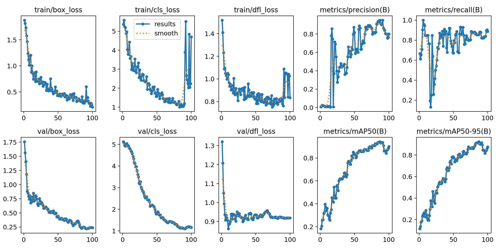
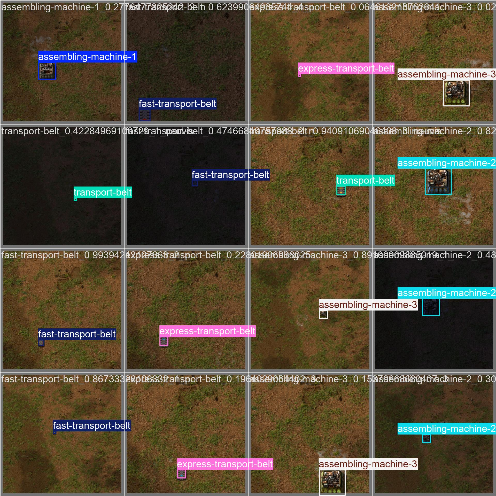
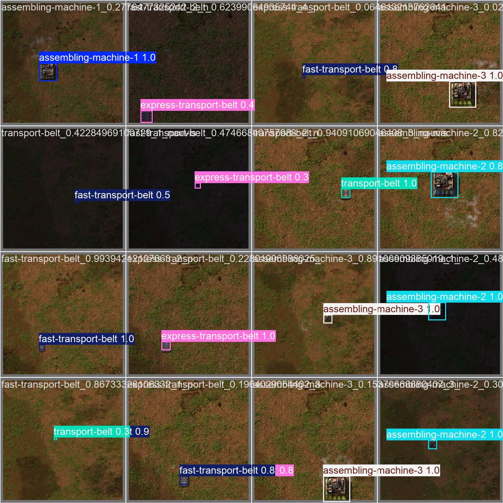

# Factorio YOLO v0

A YOLOv11n model for detecting items in Factorio. It can detect 6 items, see [names](./dataset/detect.yaml).

## Results



Validation batch 0 labels and predictions:

<div style="display: flex; justify-content: center; gap: 1rem;">
  
  
</div>

## Dataset

The dataset is a collection of images of items in Factorio, [collector code here](../../packages/factorio-rcon-snippets-for-node/src/factorio_yolo_dataset_collector_v0.ts).

## Training

```bash
pixi train
```

## Predicting

It will show a window with the predicted bounding boxes.

```bash
pixi predict
```
